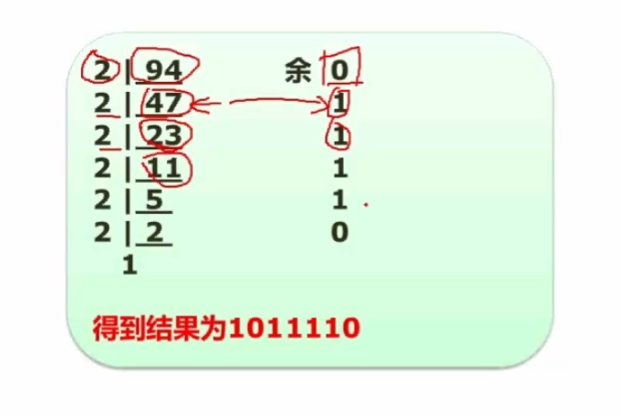
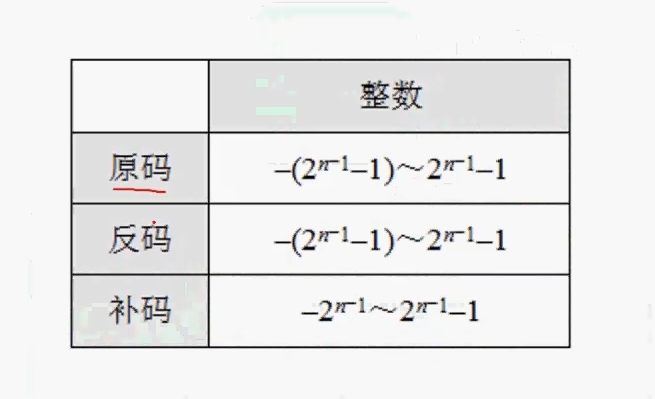
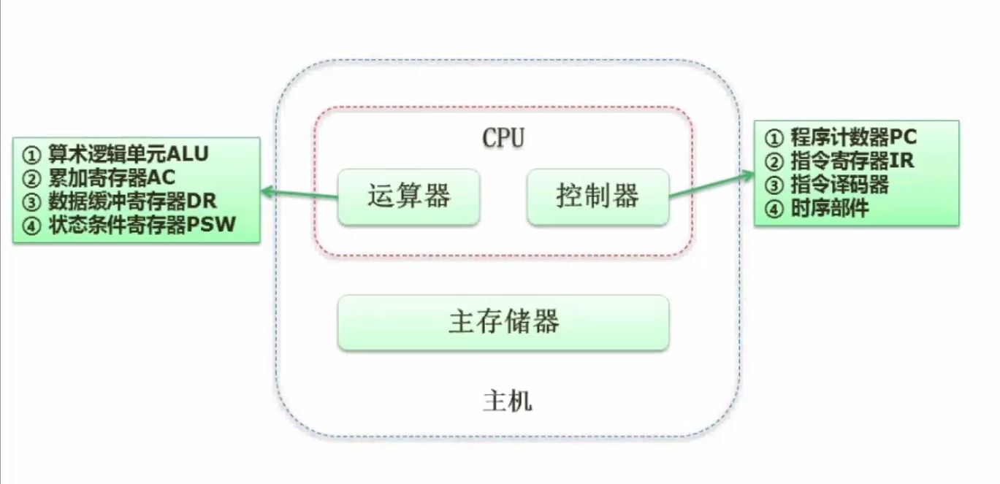

# 												软件设计师

## 一、计算机组成与体系结构

### 		1-1  数据表示(进制的转换)

- R进制转十进制(*按权展开法*)：

$$
二进制转十进制:10100.01 = 1\times2^{4}+1\times2^{2}+1\times2^{-2}
$$

$$
七进制转十进制:604.01=6\times7^{2}+4\times7^{0}+1\times7^{-2}
$$

- 十进制转R进制(*短除法*):

  

  ### 1-2  数据的表示(原码反码补码移码)

  ```java
  1.正数的原码、反码和补码完全相同
  2.负数的反码为原码的符号位不变，符号位后面的所有位置按位取反;
  	   补码是在反码的基础上加一;
  3.移码一般用来做浮点运算的阶码
    移码就是在每个数补码的基础上将符号位取反
  ```

  

  ​																					n位字节长的数值表示范围

  |      | 整数                     |
  | ---- | ------------------------ |
  | 原码 | -127~127                 |
  | 反码 | -127~127                 |
  | 补码 | -128~127（不区分正负零） |

  ​																					8位字节长的数值表示范围

  ### 1-3  数据表示(浮点数运算)

  $$
  浮点数表示:
  N = M \times R^{e}\\
  其中M称为尾数,e是指针,R为基数.\\
  浮点数运算操作步骤:1.对阶
  				2.尾数求和
  				3.规格化
  				4.尾数舍入
  				5.判溢出
  $$
  ### 2-1  计算机结构

  

  ### 2.2  计算机体系结构分类-Flynn

  |      体系结构类型      |                             结构                             |                  关键特性                  |                            代表                            |
  | :--------------------: | :----------------------------------------------------------: | :----------------------------------------: | :--------------------------------------------------------: |
  | 单指令流单数据流(SISD) | 控制部分：一个  <br />处理器：一个  <br />主存模块：一个  <br /> |                     无                     |                        单处理器系统                        |
  | 单指令流多数据流(SIMD) | 控制部分：一个  <br />处理器：多个  <br />主存模块：多个  <br /> | 各处理器以异步  <br />的形式执行同一条指令 | 并行处理机  <br />阵列处理机  <br />超级向量处理机  <br /> |
  | 多指令流单数据流(MISD) | 控制部分：多个  <br />处理器：一个  <br />主存模块：多个  <br /> |                  不实际的                  |                          目前没有                          |
  | 多指令流多数据流(MIMD) | 控制部分：多个  <br />处理器：多个  <br />主存模块：多个  <br /> | 能够实现作业任务  <br />指令等各级全面并行 |                    多处理机系统多计算机                    |

  

  ###  2.3  CISC与RISC的区别

  | 指令系统类型 |                             指令                             |  寻址方式  |                      实现方式                      |            其它            |
  | :----------: | :----------------------------------------------------------: | :--------: | :------------------------------------------------: | :------------------------: |
  |  CISC(复杂)  |              数量多，使用频率差别大，可变长格式              |  支持多种  |                微程序控制技术(微码)                |         研制周期长         |
  |  RISC(精简)  | 数量少，使用频率接近，定长格式，大部分为单周期指令，操作寄存器，只有Load/Store操作内存 | 支持方式少 | 增加了通用寄存器;硬布线逻辑控制为主;适合采用流水线 | 优化编译，有效支持高级语言 |

  ### 2-4 流水线

  - #### 流水线基本概念

    流水线是指在程序执行时多条指令重叠进行操作的一种准并行处理实现技术。

  - #### 流水线计算:

    流水线周期为执行时间最长的一段(**指的是指令分出的部分中执行时间最长的那个**)

    流水线的计算公式:
  $$
  1条指令执行时间 + (指令条数-1)*流水线周期\\
    理论公式:(t1+t2+..+tk)+(n-1)*\Delta t(实践中首先使用理论公式)\\
    实践公式:(k+n-1)*\Delta t\\
    k指的是一条指令被分成的段数
  $$

  - #### 流水线吞吐率计算:

    流水线的吞吐率(TP)是指在单位时间内流水线所完成的任务数量或输出的结果数量。计算流水线吞吐率的最基本的公式如下:
    $$
    TP=\frac{指令条数}{流水线执行时间}
    $$
      流水线最大吞吐率:
    $$
    TP_{max} = \lim_{x \to \infty} \frac{n}{(k+n-1)}\Delta t = \frac{1}{\Delta t(流水线的周期时间)}
    $$

  - #### 流水线的加速比:

    完成同样一批任务,不使用流水线所用的时间与使用流水线所用的时间之比称为**流水线的加速比**(越高越好)。计算公式如下:
    $$
    S = \frac{不使用流水线的执行时间}{使用流水线的执行时间}
    $$

  - #### 流水线的效率

    流水线的效率是指**流水线的设备利用率**。在时空图上，流水线的效率定义为n个任务占用的时空区与k个流水段总的时空区之比。

    计算流水线效率的公式为:
    $$
    E = \frac{n个任务占用的时空区}{k个流水段的总的时空区}=\frac{T_{0}}{kT_{k}}
    $$

  ###  3-1 层次化存储结构

  - ####  Cache-概念

    Cache的功能**:提高CPU数据输入输出的速率**，突破CPU与存储系统间数据传送带宽的限制

    Cache是访问速度最快的层次(***有寄存器存在的情况选择寄存器,没有就选择Cache***)

    使用Cache改善系统性能的依据是程序的局部性原理
    $$
    如果以h代表对Cache的访问命中率,t_1表示Cache的周期时间,t_2表示主存储器周期\\时间,以读操作为例,使用“Cache+主存储器”的系统的平均周期为t_3,则:\\t_3 = h\times+(1-h)\times t_2\\
    其中,(1-h)又称为失效率(未命中率)
    $$
  
  
  
- 
  
- 
  
- 
  
- 

